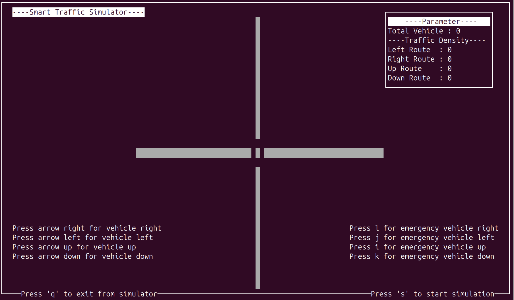

# Smart Traffic Simulator

**Smart Traffic Simulator** is a **terminal-based traffic control simulation tool** built in **C** using the **ncurses** library. It simulates a traffic intersection where users can dynamically add vehicles and test smart traffic logic prioritizing the most congested routes — including handling emergency vehicles.

---

## Features

* Terminal UI with real-time updates (powered by **ncurses**)
* Add vehicles from **UP**, **DOWN**, **LEFT**, and **RIGHT** directions
* Smart traffic management based on **route density**
* Emergency vehicle handling with top priority
* Real-time parameter panel displaying:

  * Total vehicle count
  * Per-route traffic density
* Animated visual simulation of traffic moving through an intersection

---

## Requirements

* GCC Compiler (`gcc`)
* ncurses library

---

## Installation

### On Debian/Ubuntu-based systems:

```bash
sudo apt update
sudo apt install build-essential libncurses5-dev libncursesw5-dev
```

---

## Build and Run

### 1. Clone the repository

```bash
git clone https://github.com/Aontrol/Smart-Traffic-Simulator
cd Smart-Traffic-Simulator
```

### 2. Compile the program

```bash
gcc traffic_simulator.c -lncurses -o traffic_simulator
```

### 3. Run the simulator

```bash
./traffic_simulator
```

---

## Controls

| Key            | Action                           |
| -------------- | -------------------------------- |
| ⬆️ Arrow Up    | Add vehicle from **UP**          |
| ⬇️ Arrow Down  | Add vehicle from **DOWN**        |
| ⬅️ Arrow Left  | Add vehicle from **LEFT**        |
| ➡️ Arrow Right | Add vehicle from **RIGHT**       |
| `i`            | Add **emergency vehicle UP**     |
| `k`            | Add **emergency vehicle DOWN**   |
| `j`            | Add **emergency vehicle LEFT**   |
| `l`            | Add **emergency vehicle RIGHT**  |
| `s`            | Start simulation (clear traffic) |
| `q`            | Quit the simulator               |

---

## Preview



---
